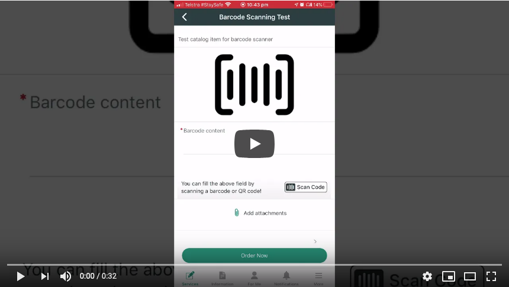
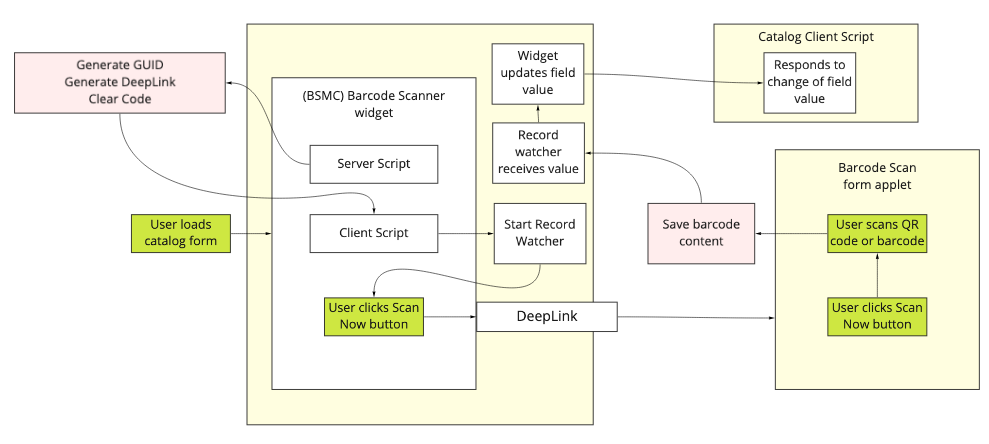

# Barcode Scan for Mobile Catalog
This is a Now Platform app which enhances the Now Mobile iOS and Android apps by allowing scanning of barcodes and QR codes into a catalog item form.

Scanning of barcodes and QR codes is a feature of the native ServiceNow mobile apps, however scanning these codes into a catalog variable is (as of writing) not a use case that is currently supported.

Simply install this app and your catalog items and record producers can support this feature!

[You can see an example of this app in action on YouTube.]()

## Installation Instructions

The app has been uploaded to ServiceNow Share.

1. [Download the XML from ServiceNow Share.](https://developer.servicenow.com/connect.do#!/share/contents/4661767_barcode_scan_for_mobile_catalog?v=1.0&t=PRODUCT_DETAILS)
2. Import the update set by uploading the XML to the instance using [the instructions on the ServiceNow Documentation](https://docs.servicenow.com/bundle/helsinki-application-development/page/build/system-update-sets/task/t_LoadCustomizationsFromAnXMLFile.html).
3. [Preview and Commit the update set.](https://docs.servicenow.com/bundle/orlando-application-development/page/build/system-update-sets/task/t_CommitAnUpdateSet.html)

You can also fork this GitHub repository into your own GitHub account, and then use the [Import from Source Control](https://docs.servicenow.com/bundle/orlando-application-development/page/build/applications/task/t_ImportAppFromSourceControl.html) feature to import the app to your instance.
## Usage
>You can refer to the **Barcode Scanning Test** catalog item in the **Barcode Scan for Mobile Catalog** category for a reference of how to leverage this application.

On your catalog items that you want to be able to scan a QR/barcode code into, simply create a new variable of type **Macro** and set the **Widget** field on this variable to point to the **(BSMC) Barcode Scanner** widget that comes with the app.

When a new QR/barcode is scanned, the value of this variable will change to the content of the QR/barcode. Use a Catalog Client Script to modify other variables on the form as a result of this.

Some example actions you may want to perform in your Catalog Client Script:

- Set an "Asset Number" variable on your form's value to be the content of the barcode that was scanned.
- Do a GlideAjax lookup of the barcode content that was scanned to find the SysID of an asset it relates to, and set an "Asset" reference variable on your form to point to that asset.

## Technical Stuff

The app works by leveraging a JSON field on the sys_user table. The field stores a GUID which is set every time the widget loads for each user. This GUID is then passed to the client, and a record watcher is started looking for changes to this field. When the user clicks the deep link which takes them into the native mobile interface, the barcode will be saved into this JSON field as well. The record watcher will see this change when the user is automatically returned to the catalog item, and can compare the GUID of the field as it exists now, to what it was when it loaded. If it is the same, it will set the scanned code as the new value for this field.

Using the GUID protects against having multiple instances of the same form open and all of them receiving the code.

## Issues & Contributions
Please use the **Issues** feature of GitHub to report issues you encounter. Contributions to this repository are welcome :-)
